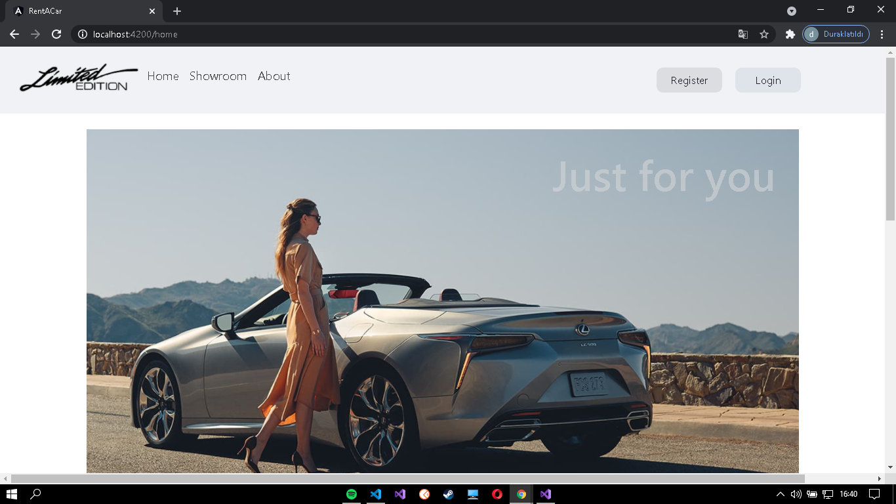
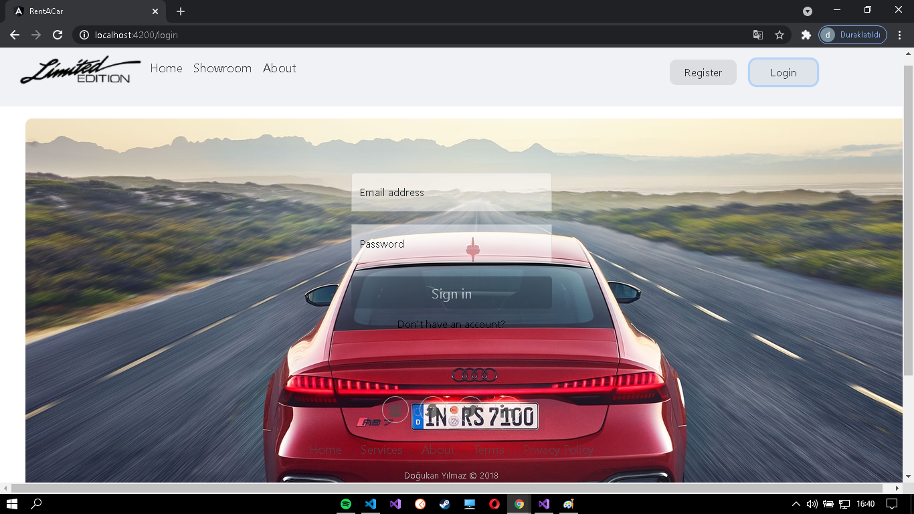
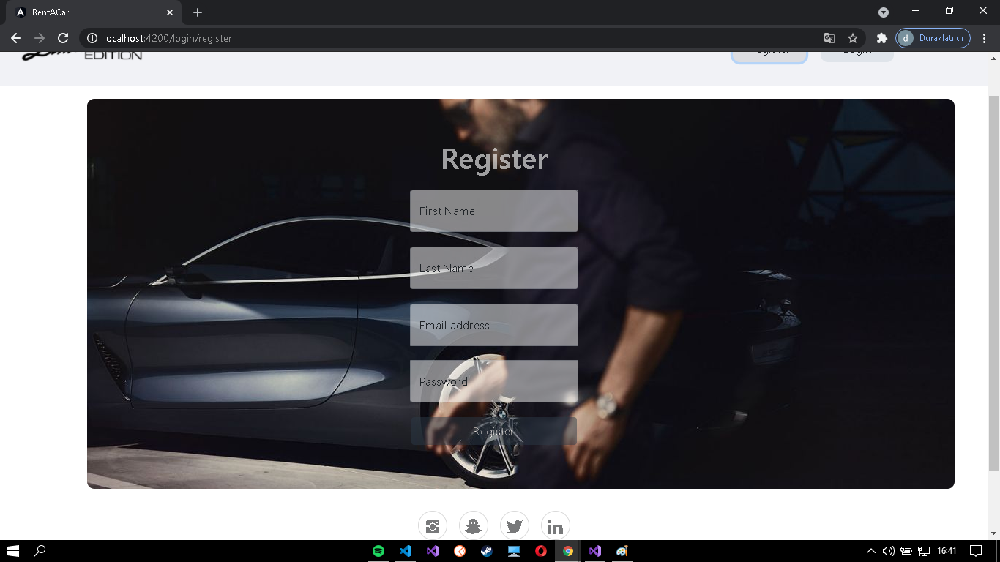
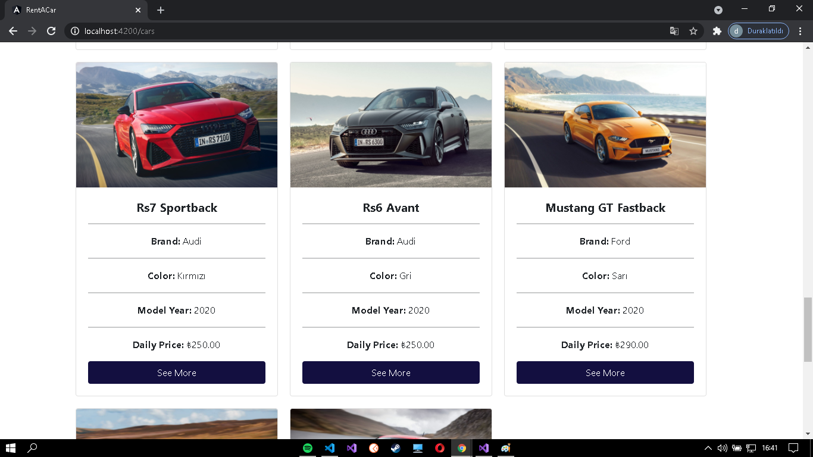
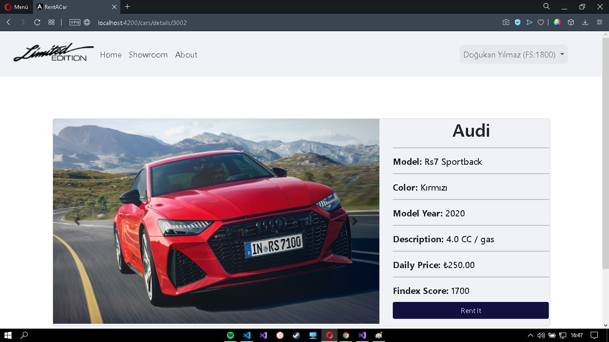
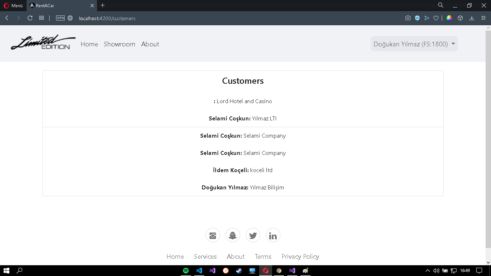
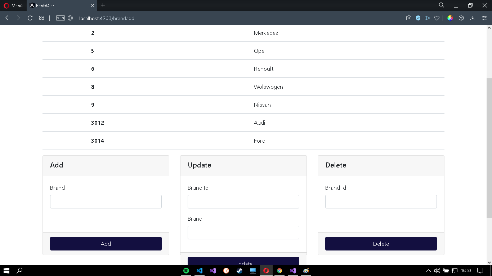
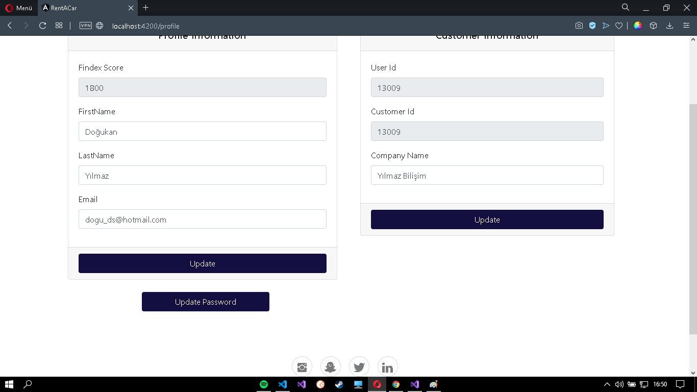
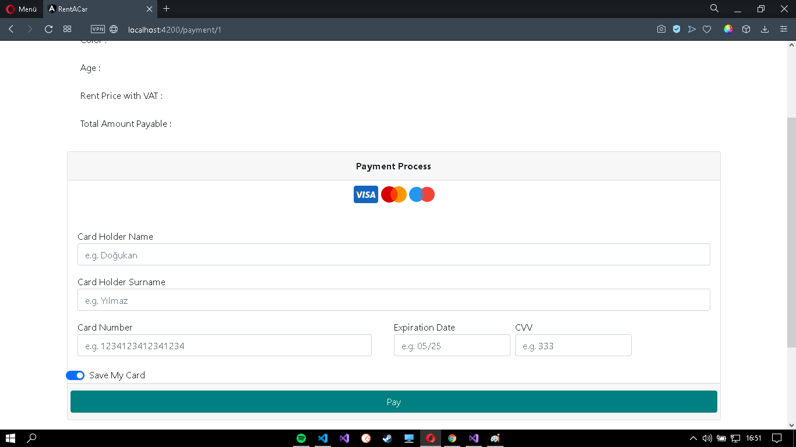

<h1 align="center">Rent a Car Project : Araba Kiralama Otomasyonu</h1> 

  

## 🎯 About

- It is written in accordance with SOLID principles. It is designed in the form of a multi-tier enterprise architecture, consisting of Entities, DataAccess, Business, Core and WebAPI layers. Jwt (Login and Register) and Middleware (error detection) are integrated into the system. 
- Angular-cli is used for Front-end. Go to [Front-end.](https://github.com/Dogukanyllmaz/RentaCar-Frontend-Angular-)

## Latest Updates
- Jwt is integrated into the system.
- CacheAspect, TransactionScopeAspect ve PerformanceAspect are integrated into the system.
- ExceptionMiddleware and Middleware integrated into the system.
- Controllers are done.
- Dto's are done.

## Table of Contents
- [About](#about)
- [Latest Updates](#latest-updates)
- [Installation](#installation)
- [Screenshots](#screenshots)
- [SQL Query](https://github.com/Dogukanyllmaz/RentaCarProject/blob/master/RentaCarSQLQuery.sql)
- [Tables in Database](#tables-in-database)

---

## Installation
**DataAccess**  
&nbsp;&nbsp;&nbsp;&nbsp; 📦 `Microsoft.EntityFrameworkCore (3.1.11)`  
&nbsp;&nbsp;&nbsp;&nbsp; 📦 `Microsoft.EntityFrameworkCore.SqlServer (3.1.11)`  

**Core**  
&nbsp;&nbsp;&nbsp;&nbsp; 📦 `Microsoft.EntityFrameworkCore (5.0.4)`  
&nbsp;&nbsp;&nbsp;&nbsp; 📦 `Castle.Core (4.4.1)`  
&nbsp;&nbsp;&nbsp;&nbsp; 📦 `FluentValidation (9.5.1)`  
&nbsp;&nbsp;&nbsp;&nbsp; 📦 `Microsoft.Extensions.Configuration.Abstractions (5.0.0)`  
&nbsp;&nbsp;&nbsp;&nbsp; 📦 `Microsoft.AspNetCore.Authentication.JwtBearer (5.0.4)`  
&nbsp;&nbsp;&nbsp;&nbsp; 📦 `Microsoft.IdentityModel.Tokens (6.9.0)`  
&nbsp;&nbsp;&nbsp;&nbsp; 📦 `System.IdentityModel.Tokens.Jwt (6.9.0)`  
&nbsp;&nbsp;&nbsp;&nbsp; 📦 `Newtonsoft.Json(13.0.1)`  

**Business**  
&nbsp;&nbsp;&nbsp;&nbsp; 📦 `Autofac (6.1.0)`  
&nbsp;&nbsp;&nbsp;&nbsp; 📦 `Autofac.Extensions.DependencyInjection (7.1.0)`  
&nbsp;&nbsp;&nbsp;&nbsp; 📦 `Autofac.Extras.DynamicProxy (6.0.0)`  
&nbsp;&nbsp;&nbsp;&nbsp; 📦 `FluentValidation (9.5.1)`  

---

## Screenshots

   
   
   
   
   
   
   
   
   
   
   

---

## 🗃 SQL Query
&nbsp;&nbsp;&nbsp;&nbsp; 📃 [RentACarSQLQuery.sql](https://github.com/Dogukanyllmaz/RentalProject/blob/master/RentaCarSQLQuery.sql) 

---

## Tables in Database
<table>
  <tr>
    <td>Cars</td>
     <td>Brands</td>
     <td>Colors</td>
  </tr>
  <tr>
    <td>

Variable Name | Data Type
------------ | -------------
Id | int
Name | NVARCHAR(50)
BrandId | int
ColorId | int
DailyPrice | decimal
ModelYear | int
Description | nvarchar(50)
   
   </td>
    <td>

Variable Name | Data Type
------------ | -------------
Id | int
Name | nvarchar(50)
   
   </td>
    <td>

Variable Name | Data Type
------------ | -------------
Id | int
Name | nvarchar(50)
   
   </td>
  </tr>
 </table>
 
 <table>
  <tr>
    <td>Customers</td>
     <td>Rentals</td>
     <td>Users</td>
  </tr>
  <tr>
    <td>

Variable Name | Data Type
------------ | -------------
Id | int
UserId | int
CompanyName | nvarchar(50)
   
   </td>
    <td>

Variable Name | Data Type
------------ | -------------
Id | int
CarId | int
CustomerId | int
RentDate | datetime
ReturnDate | datetime

   </td>
    <td>

Variable Name | Data Type
------------ | -------------
Id | int
FirstName | nvarchar(50)
LastName | nvarchar(50)
Email | nvarchar(50)
PasswordHash | binary(500)
PasswordSalt | binary(500)
Status | bit

   </td>
  <tr>
    <td>CarImages</td>
     <td>OperationClaims</td>
     <td>UserOperationClaims</td>
  </tr>
  <tr>
  <td>
  
  Variable Name | Data Type
------------ | -------------
Id | int
CarId | int
ImagePath | nvarchar(500)
Date | datetime
  
  </td>
  <td>
  
  Variable Name | Data Type
------------ | -------------
Id | int
Name | nvarchar(100)
  
  </td>
  <td>
  
  Variable Name | Data Type
------------ | -------------
Id | int
UserId | int
OperationClaimId | int
  
  </td>
  
  </tr>
  </tr>
 </table>

 _**Code released under the [MIT](https://github.com/Dogukanyllmaz/RentalProject/blob/master/LICENSE) License. © 2021 Doğukan Yılmaz**_
